# Pimp my Github page
Inspired by [timburgan](https://github.com/timburgan) who made creative use of Github actions to power a chessboard on this profile,
I wanted to make a visually interesting guestbook-like system on mine.

Before I delved into it I started by scoping out my requirements, resulting in the following list.
- Visually interesting
- Instant user feedback
- Needs to look good in both light and dark mode

As I wanted this to be hosted on my Github homepage, I had to take these constraints into account as well:
- Embeddable in the profile `README.md` markdown file
- Driven by Github-Actions

Ok, so I thought: guestbook > basically names on a page > Names > I want people to add their name to my homepage.
This brought me to the Graffiti idea, tagging a wall is basically leaving your name 'tag' on someone else's property.
This would also be something I could make visually interesting.

I had prior experience with programmatically generating SVG files in the past, so I knew this would be able to work with Github actions.
SVG files are also embeddable by the markdown file so both these constraints were met by this method, with the added benefit that it's vector based and will remain high quality for every resolution.
As for the cherry on top: Using SVGs gives me access to CSS styling, so I would be able to change styling based on the browsers light or dark mode property!

## SVG generation
As I wanted this to be a quick in-and-out project I wanted to use a language I was familiar with, which was Python.
I've generated SVG files before using Jinja templates, but that was for simple bar graphs.

Of course I started by testing out if that same method would work for this use case as well, but it proved to be so hacky that I knew I had to look into other solutions.
Fortunately [Orsinium](https://github.com/orsinium) created a beautiful [SVG python package](https://github.com/orsinium-labs/svg.py) which brings the element construction spec to Python, perfect for this project.

@### Font Embedding 
Now I could start to plan out into how I wanted it to actually look. I started browsing Graffiti fonts on [Dafont](https://www.dafont.com) and tested out a handful of them, and quickly found exactly what I was looking for.
Unfortunately this is when I realized that I needed a way to make this font file available for the client.
Up until that point I did not realize that the SVG text element is still fully depended on the font file. I naively thought it converted itself in a path, which is obviously not the case as it's still fully editable...
Usually this is not a big issue as I would just use a font from [Google Fonts](https://fonts.google.com/) but they had no Graffiti fonts available.
So I needed a way to serve the font file, fully in CSS. After some google-fu I quickly stumbled on a [blog post from Nicolas Fränkel](https://blog.frankel.ch/fonts-embedded-svg/) addressing this exact issue!
They demonstrated a way to embed the font files as Base64 and 'hardcode' it directly into the CSS file, craaaaazy but the exact solution I needed.  
```
@font-face { 
  font-family: "Crysh Graffiti Regular";
  src: url(data:application/octet-stream;base64,AAEAAAAQAQAABAAARkZUTZo3u9oAANXEAAAAHEdERUYBCgHLAAC...)
}
```
| 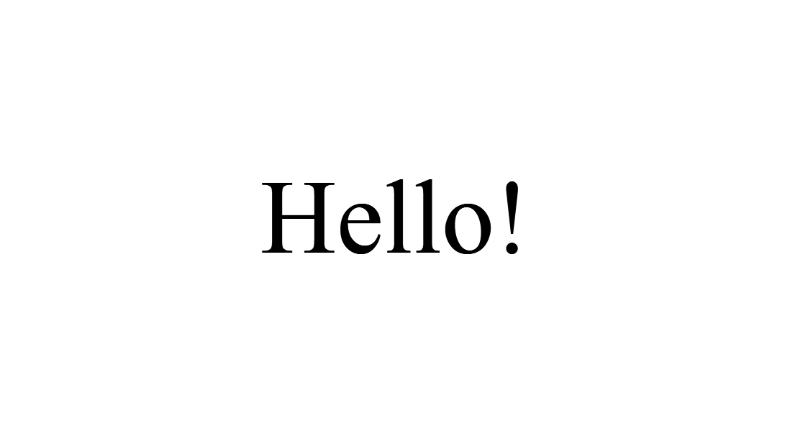 | 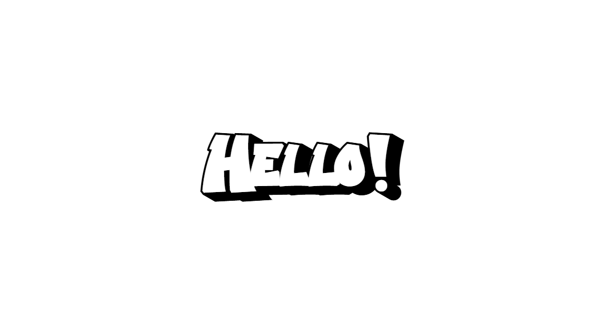    |
| -------- | ------- |
| without font | with embedded font|

## Light & Dark-Mode Gradient Support
Now that I had a working method to generate SVG files with custom fonts I wanted to address the light and dark mode requirement.
Initially this proved to be very straightforward using the `light-dark()` [color-scheme feature](https://developer.mozilla.org/en-US/docs/Web/CSS/Reference/Values/color_value/light-dark) CSS function on the fill property.
```
<style>
  :root {
    color-scheme: light dark;
  }

  title {
    fill: light-dark(rgb(0,0,0),rgb(255,255,255));
  }
</style>

```
| 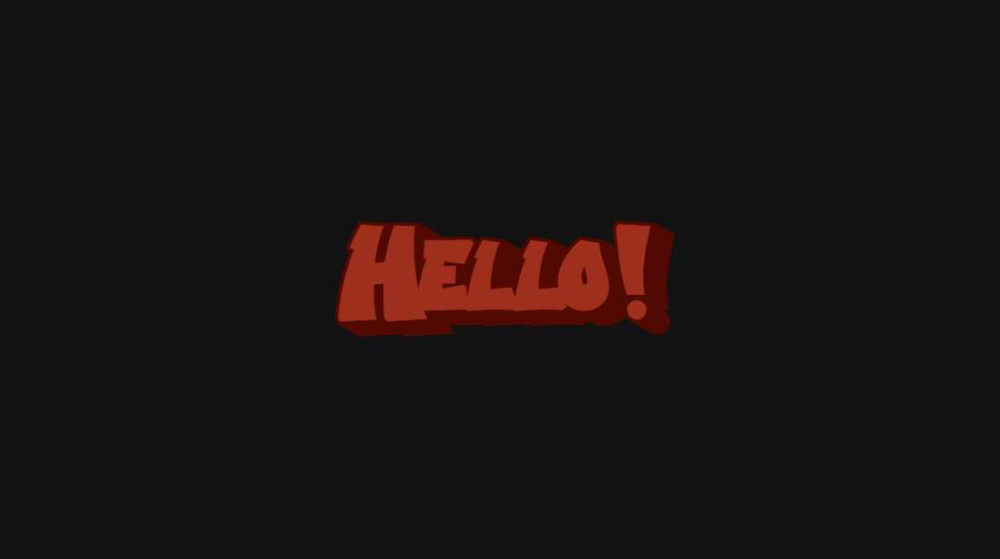 | 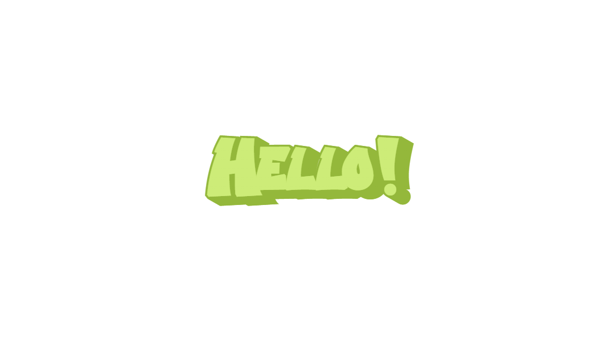    |
| -------- | ------- |
| plain color - dark mode | plain color - light mode |

Unfortunately with just plain fill colors I was not able to achieve a convincing Graffiti effect, which violated my 'Visually interesting' requirement.
Just as real graffiti, I needed gradients.
Normal CSS gradient features do not work on SVG elements, so I had to use the SVG [linearGradient](https://developer.mozilla.org/en-US/docs/Web/SVG/Reference/Element/linearGradient) elements.
To my surprise the python module had support for this as well, making it pretty straight forward to implement.

Trouble began when I had to get this working with the `light-dark()` switch as before.
This is because the target value is not just a "string" value, but a URL pointing towards the gradient element.  
without light-dark implementation:
```
<svg>
  <defs>
    <linearGradient id="myGradient" gradientTransform="rotate(90)">
      <stop offset="5%" stop-color="gold" />
      <stop offset="95%" stop-color="red" />
    </linearGradient>
  </defs>

  <!-- using my linear gradient -->
  <circle cx="5" cy="5" r="4" fill="url('#myGradient')" />
</svg>
```
What I wanted-but-didnt-work-implementation:  
```
<svg>
  <defs>
    <linearGradient id="myGradientLight" gradientTransform="rotate(90)">
      <stop offset="5%" stop-color="gold" />
      <stop offset="95%" stop-color="red" />
    </linearGradient>
    <linearGradient id="myGradientDark" gradientTransform="rotate(90)">
      <stop offset="5%" stop-color="pink" />
      <stop offset="95%" stop-color="green" />
    </linearGradient>
  </defs>

  <circle cx="5" cy="5" r="4" class="gradientclass" />
  <style>
      .gradientclass {
          fill: light-dark(url('#myGradientLight'), url('#myGradientDark'));
      }
  </style>
</svg>
```
I needed to find another way to get a light dark mode switch working.
For my second attempt I defined them as CSS variables, which also didn't work.
```
--svg-gradient-title-light-test: url(#gradient-title-light);
--svg-gradient-title-dark-test: url(#gradient-title-dark);
fill: light-dark(var(--svg-gradient-title-light-test),var(--svg-gradient-title-dark-test));
```
In the end got this working with media queries, but I did notice that sometimes the gradients do not load in, requiring a page refresh.
```
<svg>
    <defs>
        <linearGradient id="gradient-title-light" gradientTransform="rotate(90)">
            <stop offset="5%" stop-color="gold" />
            <stop offset="95%" stop-color="red" />
        </linearGradient>
        <linearGradient id="gradient-title-dark" gradientTransform="rotate(90)">
            <stop offset="5%" stop-color="pink" />
            <stop offset="95%" stop-color="green" />
        </linearGradient>
    </defs>
    <circle cx="5" cy="5" r="4" class="gradientclass" />

    <style>
        :root {
          --svg-gradient-title: url(#gradient-title-light);
          --svg-glow-title: #ffadda;
          color-scheme: light dark;
        }

        @media (prefers-color-scheme: dark) {
          :root {
            --svg-gradient-title: url(#gradient-title-dark);
            --svg-glow-title: #003d16;
          }
        }

        .title {
          fill: var(--svg-gradient-title);
          text-shadow: 0 0 4px var(--svg-glow-title);
        }
    </style>
</svg>
```
At last, we have a Text element which has a cool font, a gradient and looks good in dark and light mode!
| 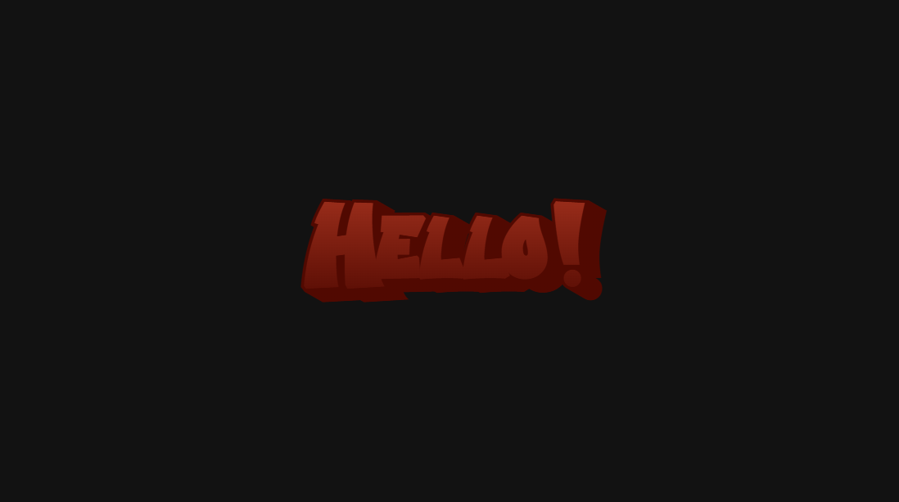 | 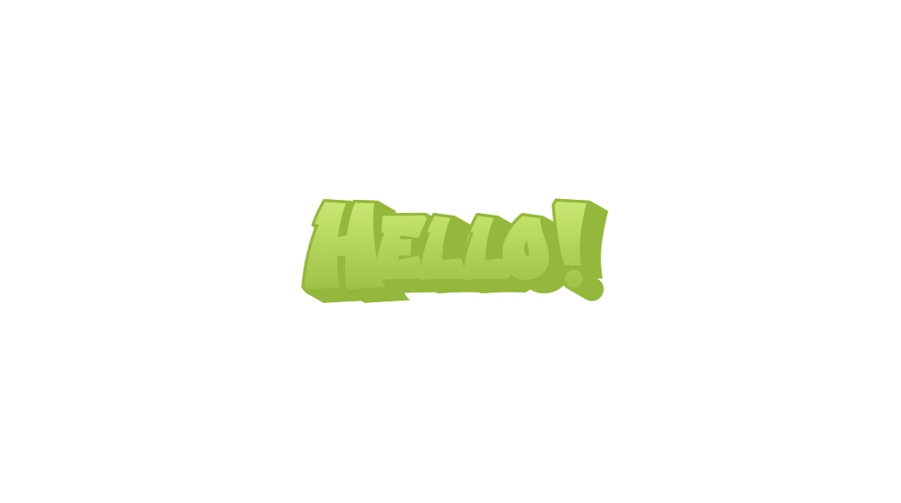    |
| -------- | ------- |
| gradient - dark mode | gradient - light mode |


## SVG parsing
Now that I had the visuals I wanted, I started to connect everything together to build the construction flow.
Which consists of: generating a tag element, adding this element to the SVG canvas and writing this canvas to disk.
This was done in no-time with the SVG python module.

That was until I started on the update flow: reading the existing SVG file from disk,... wait how do I parse this file back to Python objects?  
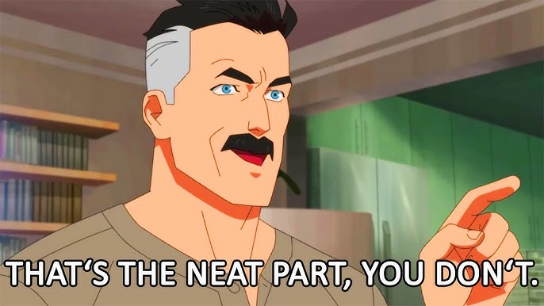

Parsing files is not part of the SVG spec, and so is not included in the Python SVG module either.
I had to find another way to parse the SVG file back to a usable SVG python object.
Luckily the SVG spec is very close to the XML spec, so the solution I came up with was to use the Python build-in [minidom](https://docs.python.org/3/library/xml.dom.minidom.html) XML parser.
Using the minidom parser I could read the properties from the existing tag elements, then use those to reconstruct the tag Python objects.

With this fix I had both the construction and update flow covered.

## Loading in SVG snippets
Even though the flow was working as it should, I found the visual side of things lacking.
The current resulting banner was not "grounded" enough, the tags still looked out of place even with the gradients.
I wanted to hint that the banner resembled a wall, so I wanted to show some bricks.
After finding the perfect SVG bricks and cracks I needed on [The Noun Project](https://thenounproject.com/), I needed to load these files into the banner.
I was again facing the same issue as I had with parsing the existing tags from the banner.
After looking into the source code of the python svg module I found a `text` property on every SVG Element.
This `text` property contains the string value of the SVG Element python object.
So by passing in the contents of my `brick.svg` file into that property as a string I'm able to reference in these files in Python.
Unfortunately this does not mean it is a fully initialized Python SVG object, but it's good enough to use as a building block within the banner generation code.
| 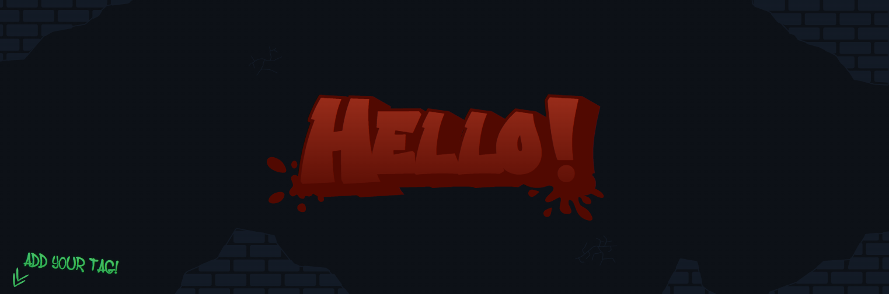 | 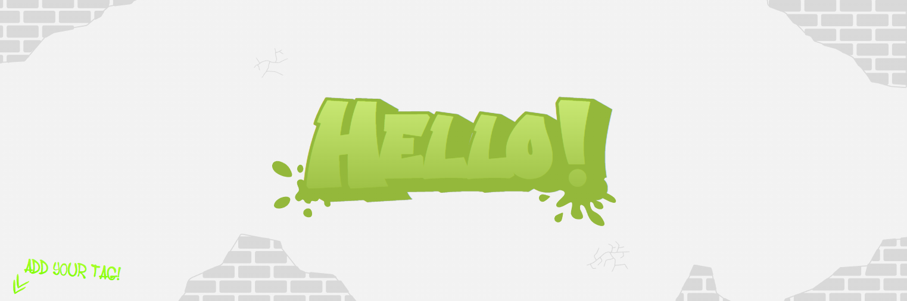    |
| -------- | ------- |
| svg elements - dark mode | svg elements - light mode |


## TextElement bounding box
I simulated 50 randomly located tags on the canvas and noticed that there were partially out-of-bounds tags.
This issue violates the 'Instant feedback' requirement, as the user might not see their name on the canvas and might think it didn't work.  
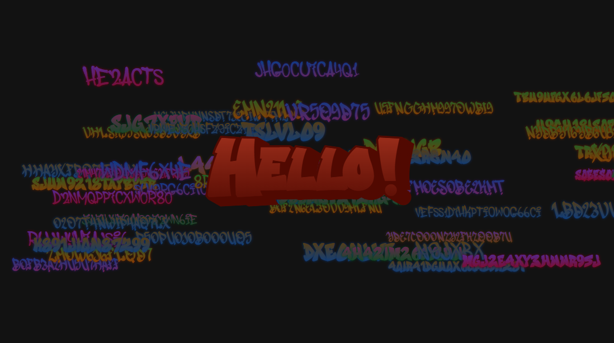

The "root" point of these text elements are the bottom left of the element.
So I naively thought: "oh I just need to subtract the boundingbox of the text element from the allowed spawnable area"

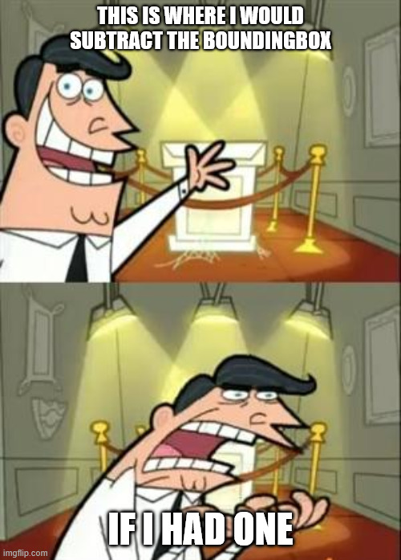  
That would be the case IF the text element had a boundingbox property 😭

I had to find my own way to calculate the boundingbox, but the system did need to take these two constraints into account:
  - Different fonts, some of the graffiti fonts are much wider than others.
  - Different fontsizes, I want to scale down very long names so the boundingbox should adhere to this.

The method I came up with was: averaging out the character width using a fixed fontsize.
Which I did by typing out the full alphabet using font-size 32 and manually fitting a bounding box around it.
After which I divided the width of that manually made bounding box by 26, to get the average width of each character using font-size 32.
By dividing these width and height pixel values by the font-size (32) we get a ratio value!
We can use these ratios by multiplying it with the actual used font-size and the amount of character in the tag to get the boundingbox width.
This approximation worked much better than expected!  
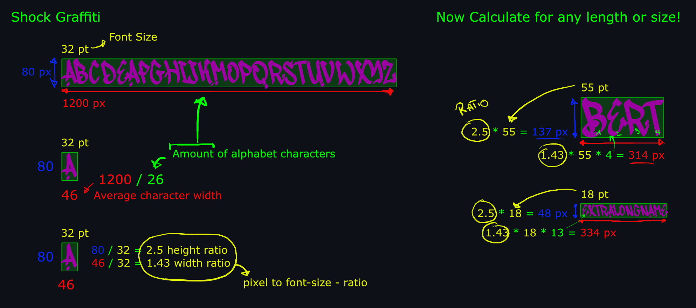

Now I could finally make sure that all the Text elements spawn fully within the canvas bounds, or so I thought...  
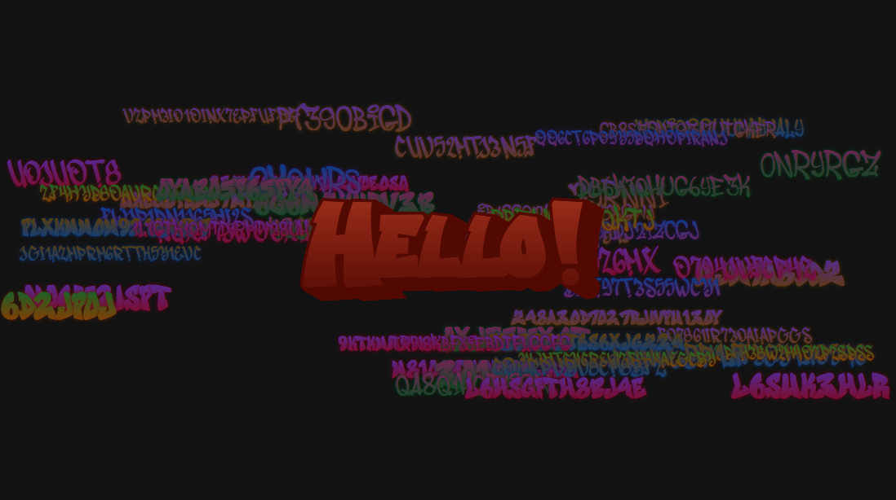  


## Custom Rotation Matrix
As per requirement 1, `visually interesting` I want the tags to have a level of randomness in their rotation.
UNFORTUNATELY this means that the boundingbox needs to rotate as well.  
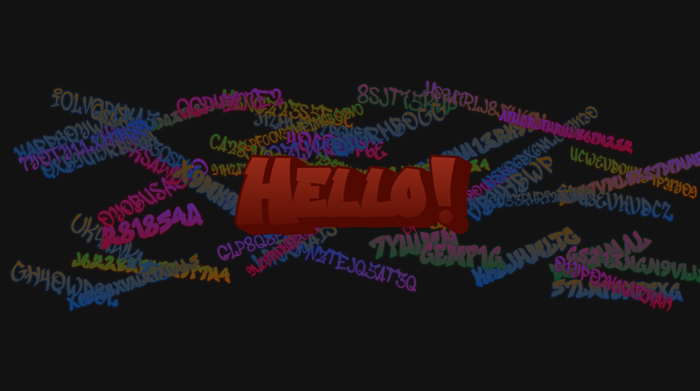  

I dusted off my old math textbook (literally) and figured out how to calculate those transformations.
The goal was to rotate each corner of the bounding box around the custom rotation point to get the rotated corner positions.
I ended up doing these calculations manually in code as I didn't want to add the numpy dependency solely to do a couple of matrix multiplications.
| 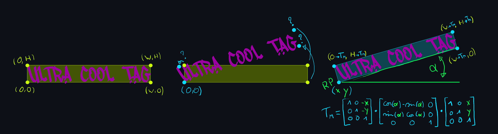 |
| -------- |
|default bounding box points (1)   -   rotated textelement with wrong bounding box (2)   -   manually calculated bounding box corner locations (3)|


And now I finally have an accurate rotated textElement boundingbox!  
| 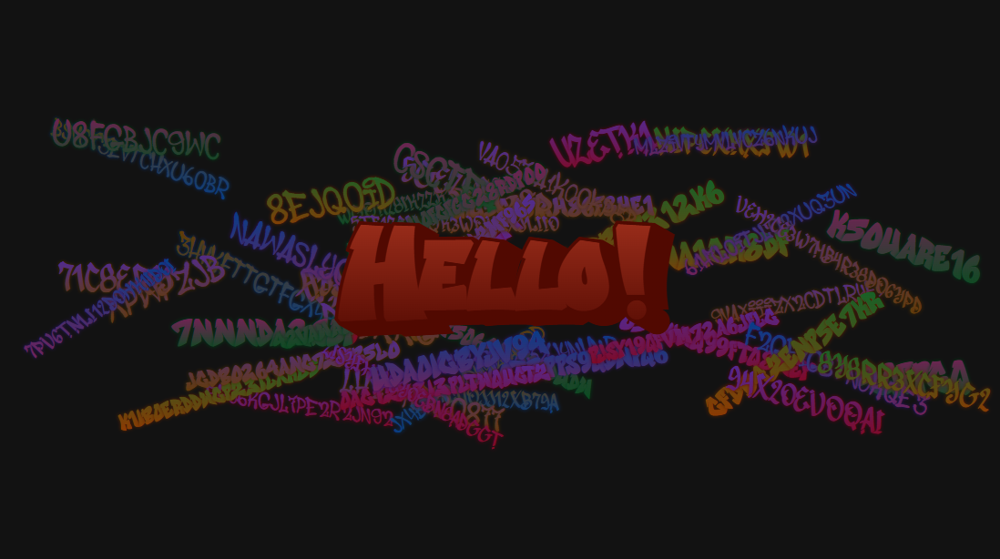 | 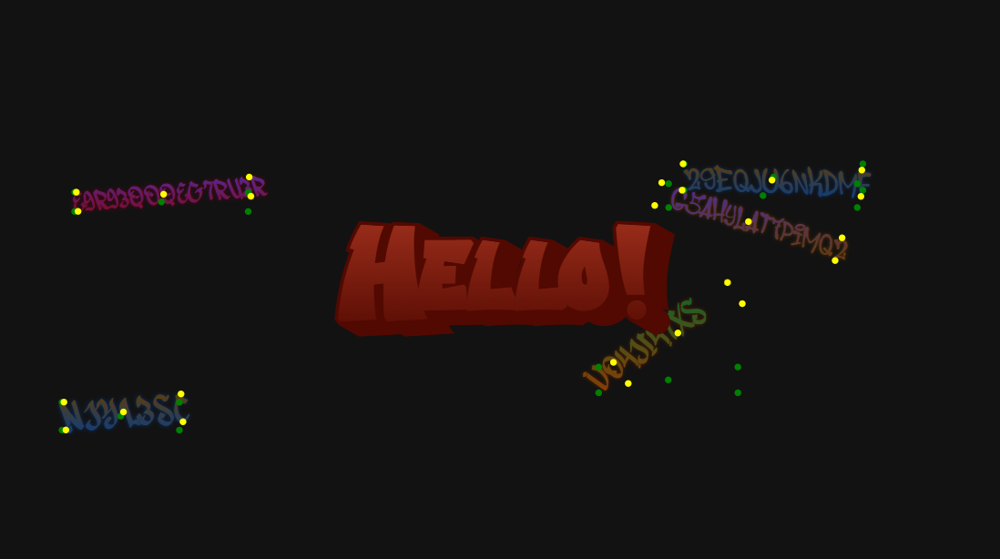    |
| -------- | ------- |
| rotated tags within canvas | old (green) vs new (yellow) boundingbox corners|

## Final touches for the tags
I was happy with the current implementations, but I still felt like these name tags were too 'static'.
Especially when there were long names involved, I needed a way to put more life into them.
Giving each character in the name an offset was not ideal as that would mean that I needed a separate text element for each of them.
Not that long after I found the solution I needed, The [TextPath element](https://developer.mozilla.org/en-US/docs/Web/SVG/Reference/Element/textPath)!
This element allows you to run your text element over an SVG path, the only thing I had to do was to create a path which introduces some dynamic height into the characters.
After some trial and error I found that chaining a random amount of randomized arc-paths sequentially resulted in the exact wobbly path I was looking for.
| 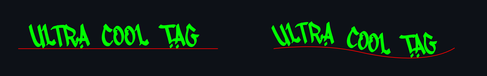 |
| -------- |
|normal Text element (left), TextPath element on double arc path (right) |


## Exclusion zones
Now I had everything working, text with a custom font, some bricks to make it all more grounded, tags with a correct bounding box.
I ran a couple of tests, with 200 name-tags and realized it just became one huge mess.
The title and bricks are getting fully covered by the name-tags and it is not the effect I was hoping to get.
If a name-tag spawns behind the title it could be fully hidden from the user, thus violating the `instant feedback` requirement.
I want to make sure no tags spawn on the bricks or behind the title.  
These are the exclusion zones I wanted to implement.
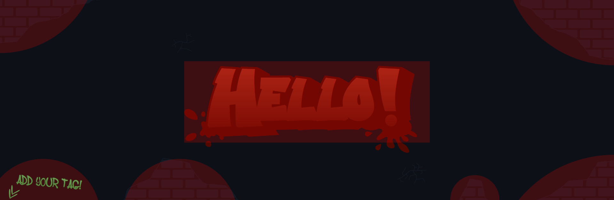

If the tags did not have a rotation this would be easy. The I would just be able to check if the value of the left side of the tag bounding box sits within the exclusion left and right side, same for top and bottom. Unfortunately I have a rotation on that bounding box which breaks this method.
I would need a corner based check, luckily I already have my exact corner coordinates with the rotation matrix I calculated beforehand.
Doing a collision check with arbitrary shapes would require a lot of math. Fortunately I could just use circles and squares making it pretty straight forward.  
For the circle I check if any corner of the tag its distance to the center is smaller than the radius (two values I can easily obtain), the tag collides with the circle.
For the square I check if the distance between the corner of the tag and the corners of at least 3 corners of the square is smaller than the height/width of the square.
If this is the case, the tag collides with the square. This method does not work with rectangles, as their height and width are not equal, so I just put multiple squares beside each other.  
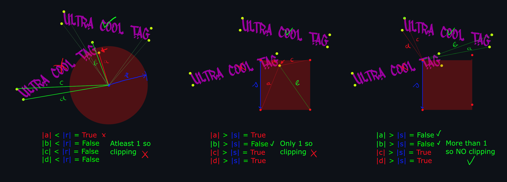

I've added these exclusion squares and circles, behind the title and the bricks and simulated 200 name-tags. 
99% of these tags are perfect! But it seems like I had an edge case which I did not think of.
If the corners of the tag "wrap" the exclusion zone, the corners technically don't intersect.
I fixed this by adding another boundingbox 'corner' point to the center of the Tag.
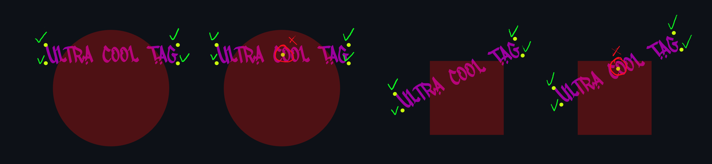
| 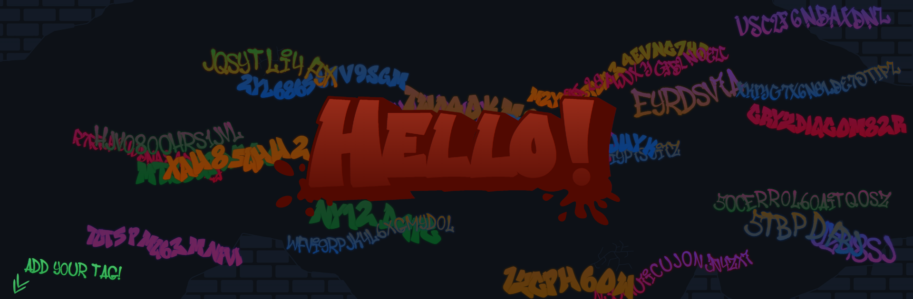 | 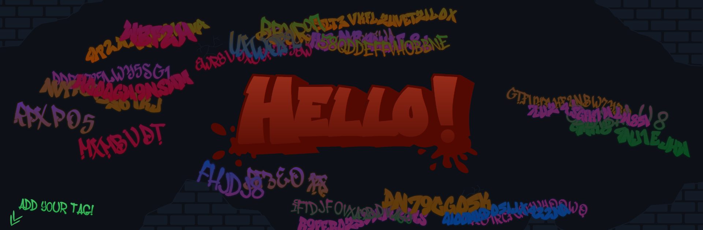    |
| -------- | ------- |
| Without exclusion zones | With exclusion zones|


## Github Caching
I finished gluing everything together in the Github CI and tested all the scenarios.
This worked flawlessly, it was fast and the banner always updated instantly right after the Github-Action finished.
But to my surprise this was no longer the case when I made the repo public.
Now it took 15 minutes to display the latest version of the banner on the README.md.
When manually opening the banner.svg file it does show the latest updated version, but the embedded version inside the README.md did still show the previous version!
I never expected this to be an issue but immediately suspected that there must be some caching which is ruining the party.
My suspicion was correct, and there seemed to be a well documented way to manually invalidate the Github caches.
Github has a service called [Github Camo](https://docs.github.com/en/authentication/keeping-your-account-and-data-secure/about-anonymized-urls) which does a couple of things, one of which is caching the image files within repos.
I tested out this cache invalidation but quickly found out that .svg files are not part of the Camo image caching, I assume they are not classified as images...
Ultimately I was unable to find a way to invalidate the cache on Github's end, so I had to find a way to forcefully do it on my end.
I simply implemented a system which adds a number suffix to the banner.svg name.
This number is generated using the timestamp when the Github action is run, and was a quick way to invalidate the cache as it forces a new entry in the cache records.


# Fin.

| 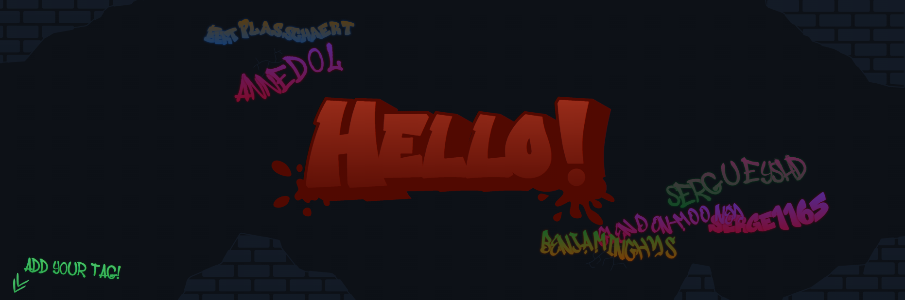 | 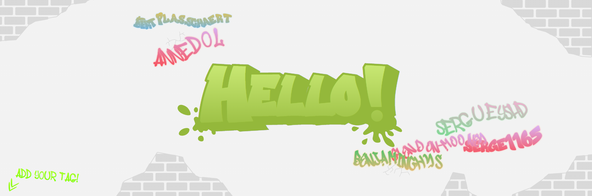    |
| -------- | ------- |
| final banner - dark | final banner - light|

This project is now fully finished.
Let's reflect on the goals / requirements I set up for myself at the start.

- [x] Visually interesting.
>I believe that I achieved this with the graffiti aesthetic using the custom fonts and gradient colors.

- [x] Instant user feedback.
>After the user triggers the Github action they can return to the repo page, which should show the update fairly quickly.
>Additionally the user will receive an email notifying that the Github action is finished, prompting them to take a look at the repo page.
>With the caching issues resolved the repo page will always show the most recent version of the banner.

- [x] Needs to look good in dark and light mode.
>By leveraging the CSS support on the SVG elements it was fairly straight forward to implement a light-dark switch,
>ensuring control over the visuals in both scenarios.

I never expected this amount of side quests I stumbled upon during his project.
These were very highly specific issues I faced, but from which I've learned a lot!  

I hope you enjoyed reading through this adventure and learned a thing or two.
Feel free to try the banner out for yourself on [my profile!](https://github.com/BertPlasschaert/)
